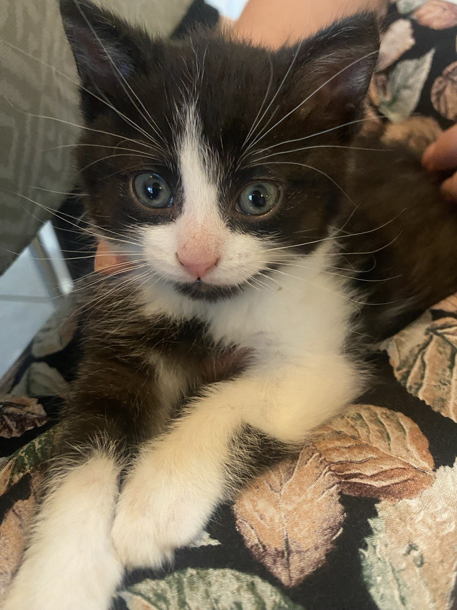

<!DOCTYPE html>
<html>

<head>

         <title> Whisker World</title>
<meta name="description" content="A website all about cats, including their attributes, personalities, and more.">
<meta name="keywords" content="cats, cat information, kitty kingdom, whisker world, felines, cat attributes, cat care">
<meta name="author" content="Golbon Jamshidi">

      

</head>

<body>

<h1>Cats Info:</h1>

<section>
          <h2>Cats are fascinating and independent creatures</h2>
          
Known for their curious and <em><b>playful</em></b> nature. Domesticated for thousands of years, they have a long history of companionship with humans. Cats are members of the Felidae family, making them relatives of wild cats like lions and tigers.
 
          
Their sharp claws, keen eyesight, and excellent balance help them be agile and effective <u>hunters</u>, even in domestic settings.

</section>
<section>
 <h2>Cats are also known for their distinct personalities.</h2>

Ranging from affectionate and social to more reserved and <em><b>independent.</em></b>
They communicate through body language, vocalizations (like purring or meowing), and their eyes and tails.

 Though they are independent, they form strong bonds with their owners, often enjoying cuddles and play.

         
</section>
<a href="index2.html">Learn more about CATS</a>
<h2> Signs that indicate your cat is happy:</h2>

<ol><li><b>Purring:</b> Cats often purr when they’re content, though they can also purr when anxious, so context matters.</li>

<li><b>Kneading:</b> Cats knead with their paws when they feel relaxed and happy, often on soft surfaces or even on their human.</li>

<li><b>Relaxed Body Posture:</b> A happy cat will have a loose and relaxed body, often lying on their side or back with paws extended.</li>

<li><b>Slow Blinking:</b> When a cat slowly blinks at you, it's a sign of trust and affection.</li>

<li><b>Playfulness:</b> Engaging in play, chasing toys, and being generally active are signs of a happy, healthy cat.</li>

<li><b>Healthy Appetite:</b> A cat that eagerly eats and enjoys their food is likely feeling well and content.</li>

<li><b>Tail Position:</b> A happy cat may carry their tail high with a slight curve at the tip, showing confidence and contentment.</li>

<li><b>Affectionate Behavior:</b> Rubbing against you, headbutting, or sitting on your lap are signs of love and happiness.</li>

<li><b>Grooming:</b> Regular self-grooming and grooming others (including you) indicate comfort and happiness.</li>

<li><b>Chirping or Trilling:</b> Some cats make chirping or trilling sounds when they are excited and happy.</ol></li>

</body>

  </html>

